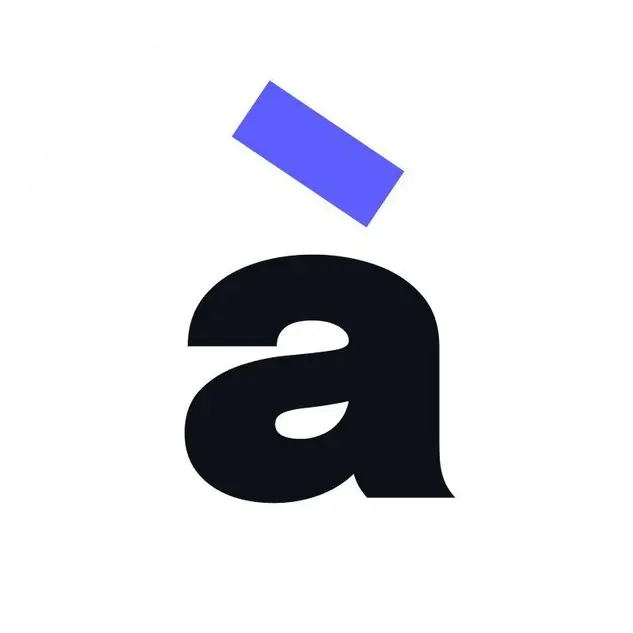

# à la fois: a Yjs server with persistence, auth, and changes history

**à la fois** is an open-source server solution for building collaborative applications. Based on CRDT library [Yjs](https://github.com/yjs/yjs). The goal of **à la fois** is to provide developers free and easy to use solution for their collaborative projects

## Features

- Persists document data to database
- Easy setup with K8s
- Scales horizontally
- Provides document-level access control via client tokens
- Api for full control of the docs

## Stack

- [Yjs](https://github.com/yjs/yjs)
- [DAPR](https://dapr.io/)
- [MongoDB](https://www.mongodb.com)

## Docs

[DOCS](https://a-la-fois.gitbook.io/docs/) (WIP)

## Examples

[Examples](https://alafois.dev/) (WIP)

## [Contribution](./CONTRIBUTING.md)
